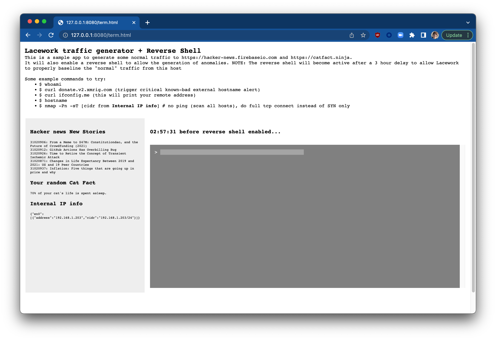

# Lacework Traffic Generator & Reverse Shell

This project is a browser based web app designed to allow a user to evaluate Lacework anomaly detection.  The nodejs app, when run, generates a baseline amount of activity for Lacework to detect.  It also includes a reverse shell feature to allow the tester to trigger anomalous and known-bad alerts commonly seen in real-world breaches.

*NOTE: This project does allow unauthenticated access to a shell on the host / network it is running on. It also serves html direct from the filesystem with a very barebones nodejs based http server. It is highly recommended to only allow access to it from controlled IP ranges. Use at your own risk, no warranties or liability is assumed*

## How it works

### Baselining

When run as a container, the app will make outbound connections to two public facing anonymous APIs (the baseline activity).  These APIs are:

- The Hacker News "new stories" feed
- The Cat Facts "random cat fact" API

### Reverse Shell

After 3 hours of running / baselining, a reverse shell is enabled, which allows the tester to run any shell command as the user who owns the parent process.  Examples of the types of tests one can run are:

- `curl` a known bad host such as https://donate.v2.xmrig.com
- `nmap` the local subnet
- Downloading and running crypto miners
- Opening a true reverse shell with `nc`

## How to build with Docker

1. Ensure you have `docker` installed locally
1. Run `docker build -t [your preferred repo name / tag]`
1. Run `docker push [your preferred repo name / tag]` to push to your preferred registry

## How to build and test locally

1. Ensure you have `nodejs` and `npm` available
1. Navigate to the `app` directory
1. Run `npm install`
1. Run `node server.js`
1. Open a browser to `http://localhost:8080/ntg-frontend.html`

## How to run

### Fargate

1. Create a new task definition in the AWS console
1. Leave all defaults
1. Add a container definition and specify the docker image name / registry where you pushed the build.  Alternatively, you can use `jdvogt/nodejs-reverse-shell:latest` or `public.ecr.aws/f9l6s8l3/nodejs-reverse-shell:latest` if you did not push to a registry
1. Add an environment variable `LaceworkAccessToken` and set the value to a valid access token from your Lacework console
1. Save the task definition and select `Actions -> Run`
1. Select your VPC and a public subnet
1. Ensure your security group allows inbound access on port 8080 from your IP address or network you will be accessing the application from
1. Ensure you have enabled Assignment of Public IP
1. Run the task

At this point your task should be starting up.

1. Click on the running task, and find the public IP address
1. Open a new browser tab and navigate to `http://[the ip of the running task]/ntg-frontend.html`

### On an EC2

1. Install `npm` and `nodejs` with `apt-get` or `yum`
2. `git clone https://github.com/lacework-community/reverse-shell-simulation-app.git reverse-shell-simulation-app`
3. `cd reverse-shell-simulation-app/app`
4. `npm install`
5. `node server.js & disown`
7. At this point you can access the app from http://<public_ip>:8080/ntg-frontend.html

### Other container platforms

1. Documentation TBD

## How to use

The running container will make periodic calls to the aforementioned APIs, and after 3 hours a reverse shell will be enabled. Follow the suggestions in the browser for commands to use to trigger anomalies.

## App Configuration (Optional)
### Environment Variables

**`MIN_TIME`**: Optional. Set the minimum time before the reverse shell console is enabled (in seconds).
